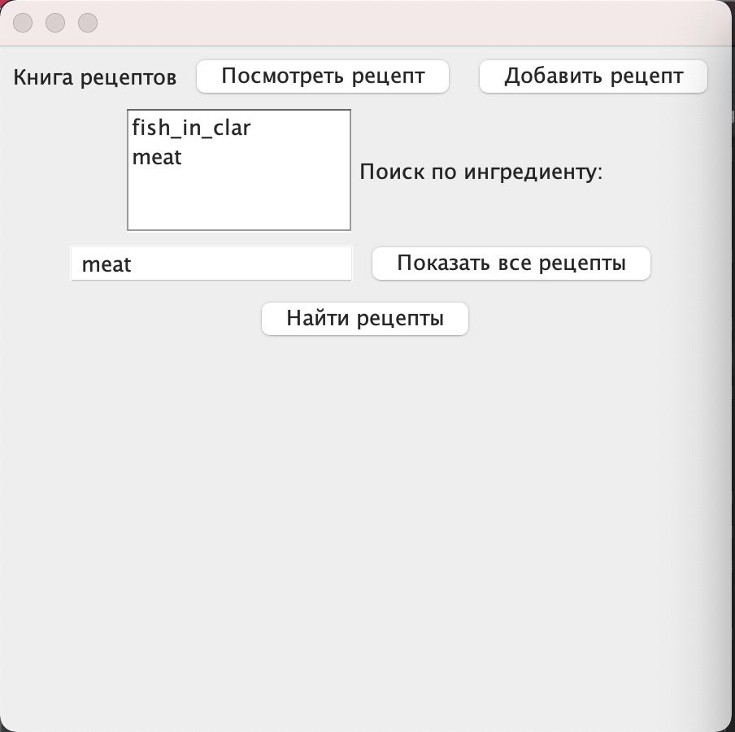
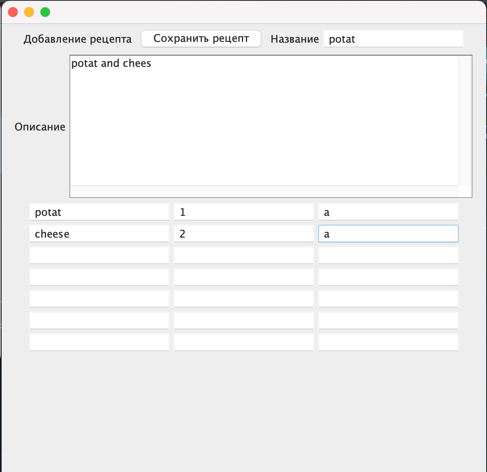
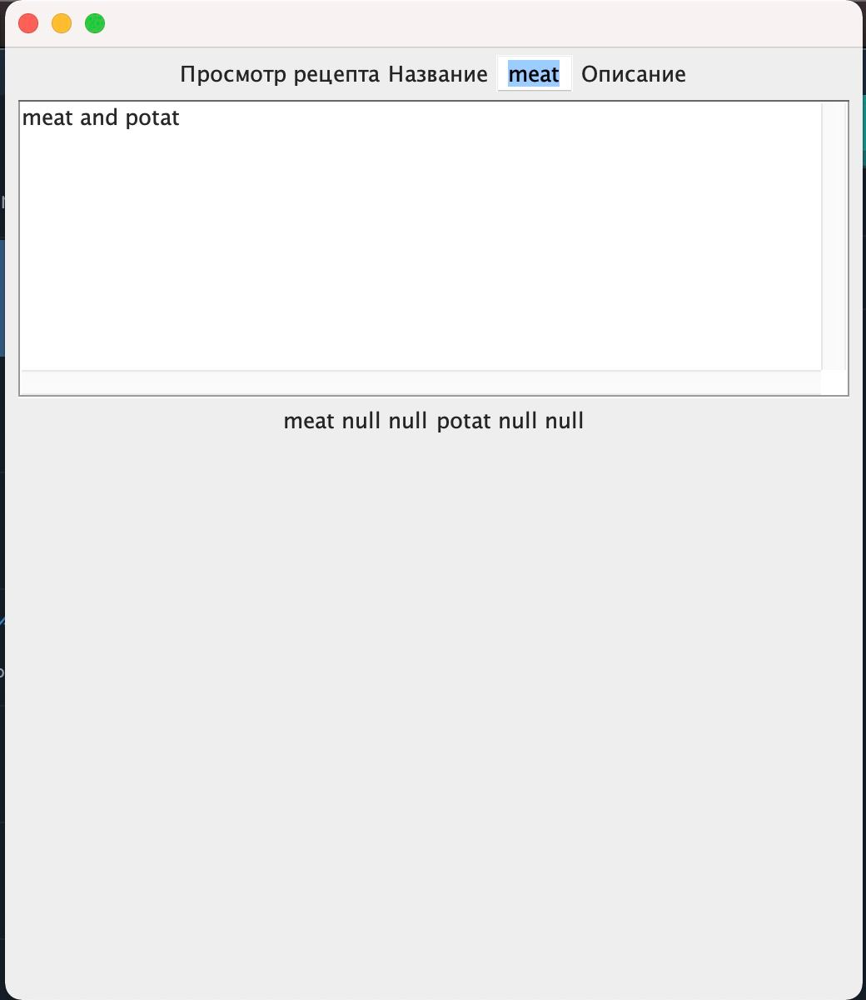

# Книга рецептов

## Описание проекта
Целью проекта является десктопное приложение, которое подразумевает возможность хранения рецептов, добавления их пользователем и просмотр. 
Все рецепты содержат название, описание и ингредиенты. При добавлении нового рецепта, все данные сохраняются локально в формате JSON и при новом запуске программы оттуда восстанавливаются.

В главном окне пользователь может просматривать список названий всех рецептов. Если выбрать одно из них и нажать на кпопку "Посмотреть рецепт", то появится новое окно со всей соответсвующей информаций. При нажатии на конопку "Добавить рецепт", открывается новое окно, с возможностью сохранения добавленной информации о рецепте.

Все задачи проекта:
1. Обсудить идею и функциональность
2. Обсудить используемые технологии 
3. Разделить обязанности
4. Реализовать прототип
5. Провести рефакторинг

## Технологии
1. Java AWT
2. Jackson
3. Jupiter Test API

## Разделение обязанностей
Помимо совместного обсуждения идеи и структуры проекта, некоторые оязанности были соответсвенно разделены:

#### Кристина:

1. Добавление основных структур проекта
2. Реализация сериализации/десериализации JSON файлов с помощью библиотеки Jackson
3. Добавление unit тестирования

#### Ирина:

1. Реализация основной логики приложения
2. Реализация окон с использованием Java AWT

#Тестирование

1. Сереализации / десериализации
2. 
3. 

#Рефакторинг

На 2 этапе проекта перед нами встали задачи: 

0. Обсудить изменения проекта
1. Исправить ошибки в программе
2. Добавить функциональность
3. Дополнить описание задач проекта
4. Большее покрытие тестами

###Было выполнено:
1. Добавлена возможность добавлять/просматривать ингредиенты рецептов
2. Находить список рецептов, по название ингредиента
3. Произведена чситка кода и вынесение новой логики в отдельные классы
4. Дописаны тесты на работу с JSON файлами
5. Разширеные задачи проекта

UI:

Главное окно:

Окно добавления:

Окно просмотра рецепта:

   